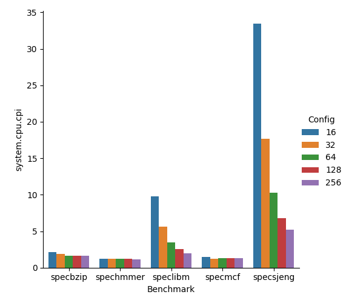
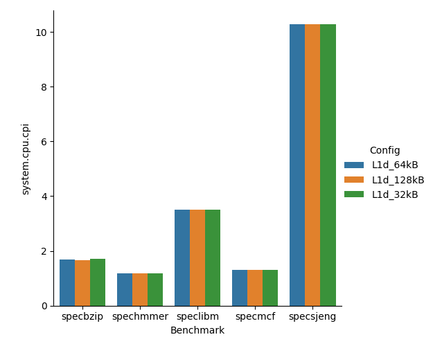
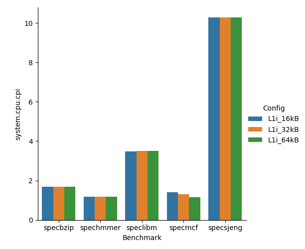
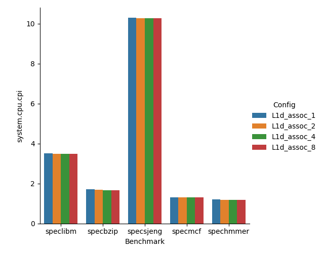
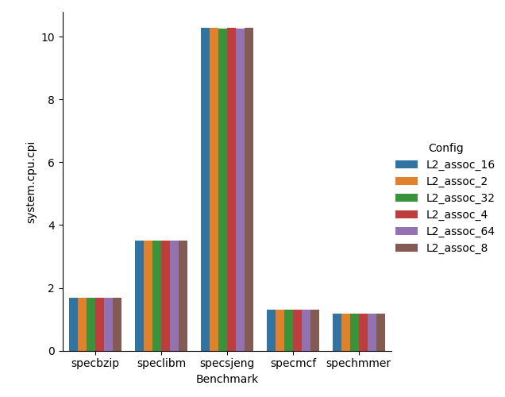

# Second Assignment: Design Space Exploration using Gem5

## Step 1: Running SPEC2006 on gem5

### 1. Default memory configuration on MinorCPU

In config.ini, we can find information about the cache memory configuration:  
```
[system.cpu.dcache]
assoc=2
size=65536

[system.cpu.dcache.tags]
block_size=64

[system.cpu.icache]
assoc=2
size=32768

[system.cpu.icache.tags]
block_size=64

[system.l2]
assoc=8
size=2097152
```

### 2. Plots of fundemental measurements


From the above graphs, the first and most abvious observation is that the CPI is proportional to the simulated seconds which is expected since the cpu is running exactly at the same frequency. Also it is apparent that high d-cache miss rate is stongly correlated to high CPI rate.

### 3. Changing the CPU clock
```
sim_freq                                 1000000000000                       # Frequency of simulated ticks

system.clk_domain.clock                          1000                       # Clock period in ticks

system.cpu_clk_domain.clock                       500                       # Clock period in ticks

```

When we change the frequency of the simulated CPU, system.cpu_clk_domain.clock changes proportionally, while system.clk_domain.clock remains constant.

Also, we notice the following entries in config.ini:
```
[system.cpu.dcache]
clk_domain=system.cpu_clk_domain

[system.l2]
clk_domain=system.cpu_clk_domain

[system.membus]
clk_domain=system.clk_domain
```

We can conclude that different things in the system run on different clocks. CPU and CPU caches have the same clock, while a different clock is used for the memory bus.

Below, we can assess how the CPU clock affects total performance.   
In tasks that are not memory-bound, the speedup is proportional to the change in clock speed. However, in tasks that are memory-bound (such as specsjeng), while there is still an improvement, it's not as significant.


### Increasing RAM frequency

We changed RAM DDR3_1600_x64 to DDR3_2133_x64 and ran the speclibm benchmark again.

The configuration change affected config.ini in the following entries:
```
tBURST=5000 -> 3752
tCK=1250    -> 938
tCL=13750   -> 13090
tRAS=35000  -> 33000
tRCD=13750  -> 13090
tRP=13750   -> 13090
tRRD=6000   -> 5000
tXAW=30000  -> 25000
```

Also, in stats.txt, we noticed improvement on the following metrics:
```
system.l2.overall_avg_miss_latency::total 77752.102348                       # average overall miss latency

system.mem_ctrls.bw_total::total           1098278144                       # Total bandwidth to/from this memory (bytes/s)

system.mem_ctrls.priorityMinLatency      0.000000016842                       # per QoS priority minimum request to response latency (s)
system.mem_ctrls.priorityMaxLatency      0.000895893688                       # per QoS priority maximum request to response latency (s)

system.mem_ctrls.totBusLat                 5584668152                       # Total ticks spent in databus transfers
system.mem_ctrls.totMemAccLat             39704848222                       # Total ticks spent from burst creation until serviced by the DRAM
system.mem_ctrls.avgQLat                      9833.28                       # Average queueing delay per DRAM burst
system.mem_ctrls.avgBusLat                    3752.00                       # Average bus latency per DRAM burst

system.mem_ctrls.avgRdBW                       555.36                       # Average DRAM read bandwidth in MiByte/s
system.mem_ctrls.avgWrBW                       542.91                       # Average achieved write bandwidth in MiByte/s
system.mem_ctrls.avgRdBWSys                    555.36                       # Average system read bandwidth in MiByte/s
system.mem_ctrls.avgWrBWSys                    542.92                       # Average system write bandwidth in MiByte/s
system.mem_ctrls.peakBW                      17057.00                       # Theoretical peak bandwidth in MiByte/s

```

This is to be expected, as a higher RAM clock allows for less latency and higher bandwidth. However, the overall effect on the program's performance was not very significant.

## Step 2: Design Exploration - Performance Optimization

### 1: Exploration methodology
In this step, we want to find the CPU cache parameters (size, assosciativity, line size) that maximize performance on SPEC2006 benchmarks. 

Checking all different combinations of parameters for L1d, L1i and L2 cache would not be very efficient, so we came up with the following methodology:  
We start from a "reasonable" configuration (the default values for MinorCPU), and then we tweak the parameters, one at a time, to observe their effect. Using shell and python scripts, the simulation, data retrieval and plotting was in large part automated.

First of all, here's what we expected CPU cache's effect on performance:
- Cache sizes  
  We know that larger cache sizes are generally beneficial, as they help minimize cache misses.  
- Cache assosciativity  
  Higher assosciativity reduces conflict misses, since data that arrives on the cache has less of a chance to displace potentially useful data.
- Cache line size  
   Larger pieces of data are retreived, taking advantage of locality. However, for a constant amount of memory, larger cache lines will lead to fewer cache lines, which results in more capacity/conflict misses. 

In gem5, we can change the above parameters without necessarily "paying" the cost of higher complexity or latency.

### 2: Results

Below are the results for tweaking different parameters. We expected more significant differences when changing cache sizes, especially for benchmarks with many cache misses. Looking at stats.txt for different configurations, we notice that although all parameters are successfully set, most of them don't seem to affect cache misses that much.  

Increasing the cache line size seemed to have the most significant positive effect on all benchmarks. This could be explained by the fact that with larger cache lines, more data is fetched into the cache when we have a miss, taking advantage of data locality. 

However, we need to keep in mind that this would increase latencies on a real systems, which might decrease performance.










## Step 3: Optimization of cost/performance ratio

In computer architecture design, all choices have benefits and drawbacks, thus any potential improvements need to be measured against the "cost" they may introduce. That cost can be in the additional area of silicon a component takes up, or it might be in the additional complexity and latency it introduces.

