# Second Assignment: Design Space Exploration using Gem5

## Step 1: Running SPEC2006 on gem5

### 1. Default memory configuration on MinorCPU

In config.ini, we can find information about the cache memory configuration:  
```
[system.cpu.dcache]
assoc=2
size=65536

[system.cpu.dcache.tags]
block_size=64

[system.cpu.icache]
assoc=2
size=32768

[system.cpu.icache.tags]
block_size=64

[system.l2]
assoc=8
size=2097152
```

### 2. Plots of fundemental measurements
_              |  _
:-------------------------:|:-------------------------:
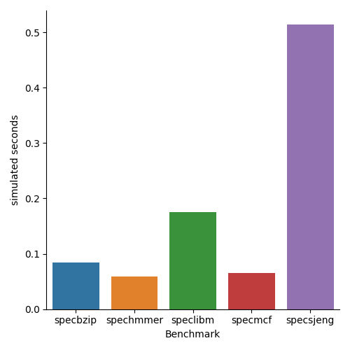 | 
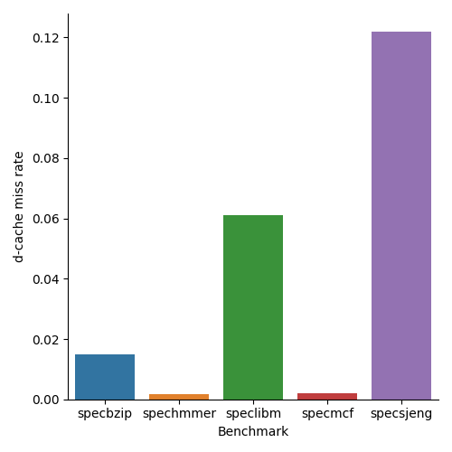 | 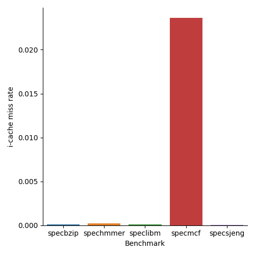
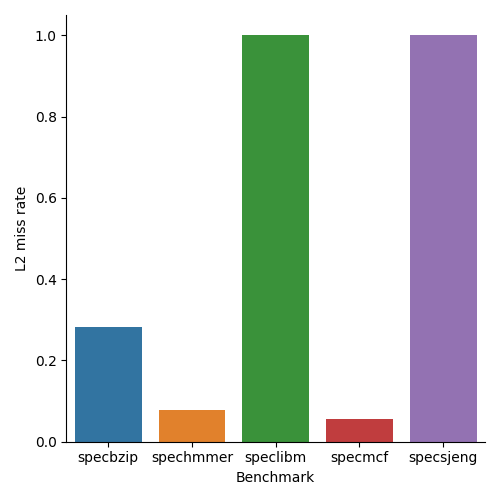 |

Here are the exact values for the above runs:

|Benchmark                                              |sim_seconds|cpi      |dcache_miss_rate|icache_miss_rate|L2_miss_rate|
|-------------------------------------------------------|-----------|---------|----------------|----------------|------------|
|specbzip                                               |0.083982   |1.679650 |0.014798        |0.000077        |0.282163    |
|spechmmer                                              |0.059396   |1.187917 |0.001637        |0.000221        |0.077760    |
|speclibm                                               |0.174671   |3.493415 |0.060972        |0.000094        |0.999944    |
|specmcf                                                |0.064955   |1.299095 |0.002108        |0.023612        |0.055046    |
|specsjeng                                              |0.513528   |10.270554|0.121831        |0.000020        |0.999972    |


From the above graphs, the first and most obvious observation is that the CPI is proportional to the simulated seconds, which is expected since the CPU is running exactly at the same frequency for all benchmarks. Also, it is apparent that high d-cache miss rate is stongly correlated to high CPI rate.

### 3. Changing the CPU clock

For the default 2GHz:
```
sim_freq                                 1000000000000                       # Frequency of simulated ticks

system.clk_domain.clock                          1000                       # Clock period in ticks

system.cpu_clk_domain.clock                       500                       # Clock period in ticks

```


For 1GHz:
```
sim_freq                                 1000000000000                       # Frequency of simulated ticks

system.clk_domain.clock                          1000                       # Clock period in ticks

system.cpu_clk_domain.clock                      1000                       # Clock period in ticks

```


For 3GHz:
```
sim_freq                                 1000000000000                       # Frequency of simulated ticks

system.clk_domain.clock                          1000                       # Clock period in ticks

system.cpu_clk_domain.clock                       333                       # Clock period in ticks

```

When we change the frequency of the simulated CPU, system.cpu_clk_domain.clock changes inverse proportionally, while system.clk_domain.clock remains constant.

Also, we notice the following entries in config.ini:
```
[system.cpu.dcache]
clk_domain=system.cpu_clk_domain

[system.l2]
clk_domain=system.cpu_clk_domain

[system.membus]
clk_domain=system.clk_domain
```

We can conclude that different things in the system run on different clocks. CPU and CPU caches have the same clock, while a different clock is used for the memory bus.

Below, we can assess how the CPU clock affects total performance.   
In tasks that are not memory-bound, the speedup is proportional to the change in clock speed. However, in tasks that are memory-bound (such as specsjeng), while there is still an improvement, it's not as significant. Therefor there is not a perfect scaling in performance by only increasing the frequency of the CPU.

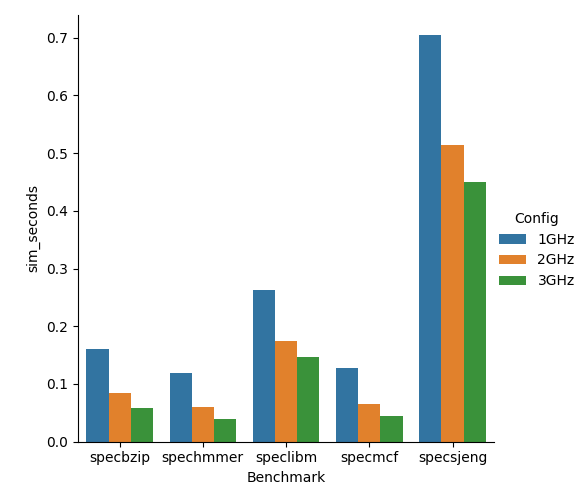


### Increasing RAM frequency

We changed RAM DDR3_1600_x64 to DDR3_2133_x64 and ran the speclibm benchmark again.

The configuration change affected config.ini in the following entries:
```
tBURST=5000 -> 3752
tCK=1250    -> 938
tCL=13750   -> 13090
tRAS=35000  -> 33000
tRCD=13750  -> 13090
tRP=13750   -> 13090
tRRD=6000   -> 5000
tXAW=30000  -> 25000
```

Also, in stats.txt, we noticed improvement on the following metrics:
```
system.l2.overall_avg_miss_latency::total                  # average overall miss latency

system.mem_ctrls.bw_total::total                           # Total bandwidth to/from this memory (bytes/s)

system.mem_ctrls.priorityMinLatency                        # per QoS priority minimum request to response latency (s)
system.mem_ctrls.priorityMaxLatency                        # per QoS priority maximum request to response latency (s)

system.mem_ctrls.totBusLat                                 # Total ticks spent in databus transfers
system.mem_ctrls.totMemAccLat                              # Total ticks spent from burst creation until serviced by the DRAM
system.mem_ctrls.avgQLat                                   # Average queueing delay per DRAM burst
system.mem_ctrls.avgBusLat                                 # Average bus latency per DRAM burst

system.mem_ctrls.avgRdBW                                   # Average DRAM read bandwidth in MiByte/s
system.mem_ctrls.avgWrBW                                   # Average achieved write bandwidth in MiByte/s
system.mem_ctrls.avgRdBWSys                                # Average system read bandwidth in MiByte/s
system.mem_ctrls.avgWrBWSys                                # Average system write bandwidth in MiByte/s
system.mem_ctrls.peakBW                                    # Theoretical peak bandwidth in MiByte/s

```

This is to be expected, as a higher RAM clock allows for less latency and higher bandwidth. However, the overall effect on the program's performance was not very significant.

## Step 2: Design Exploration - Performance Optimization

### 1: Exploration methodology
In this step, we want to find the CPU cache parameters that maximize performance on SPEC2006 benchmarks.

The parameters we will tune are the following:

Parameter             | Default value for MinorCPU
:-------------------------:|:-------------------------:
cacheline_size | 64
l1d_size |64kB 
l1i_size | 32kB 
l2_size | 2MB
l1d_assoc | 2 
l1i_assoc | 2 
l2_assoc | 8 

**In all configurations that will follow, when no value is specified, it means that we used the default.**

Checking all different combinations of parameters is, of course, not possible, so we came up with the following methodology:  
We start from a "reasonable" configuration (the default values for MinorCPU), and then we tweak the parameters, one at a time, to observe their effect. Using shell and python scripts, the simulation, data retrieval and plotting was in large part automated.

First of all, here's what we expected CPU cache's effect on performance:
- Cache sizes  
  We know that larger cache sizes are generally beneficial, as they help minimize cache misses. However, too large cache sizes introduce latency, take up silicon space (cost) and consume more energy. 
- Cache assosciativity  
  Higher assosciativity reduces conflict misses, since data that arrives on the cache has less of a chance to displace potentially useful data. However, it also results in higher latency and power demand.
- Cache line size  
   Larger pieces of data are retreived, taking better advantage of locality (reduced compulsory misses). However, for a constant amount of memory, the larger the cache lines, the fewer of them we can have, which results in more capacity/conflict misses. 

### 2: Results

Below are the results for tweaking different parameters.

We expected more significant differences when changing cache sizes, especially for benchmarks with many cache misses. Looking at stats.txt for different configurations, we notice that although all parameters are successfully set ( we double checked :D ), most of them don't seem to affect cache misses that much.  

Increasing the cache line size seemed to have the most significant positive effect on all benchmarks.

However, we need to keep in mind that this would increase latencies on a real systems, which might decrease performance. The gem5 simulator might not take all these side-effects into account by default.

_              |  _
:-------------------------:|:-------------------------:
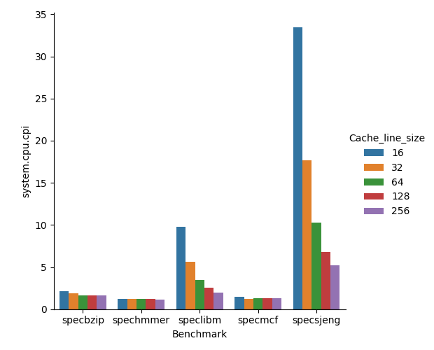 | 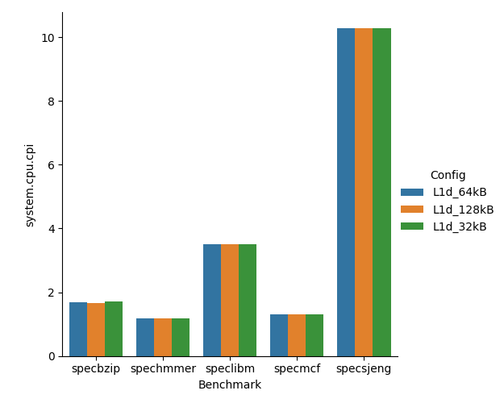
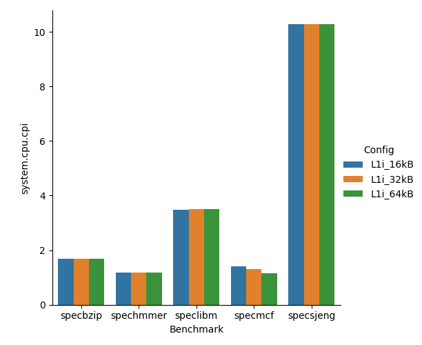 | 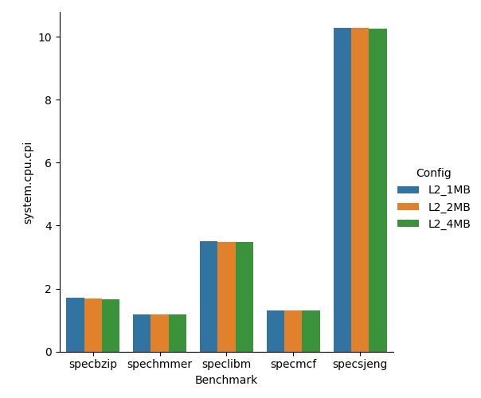
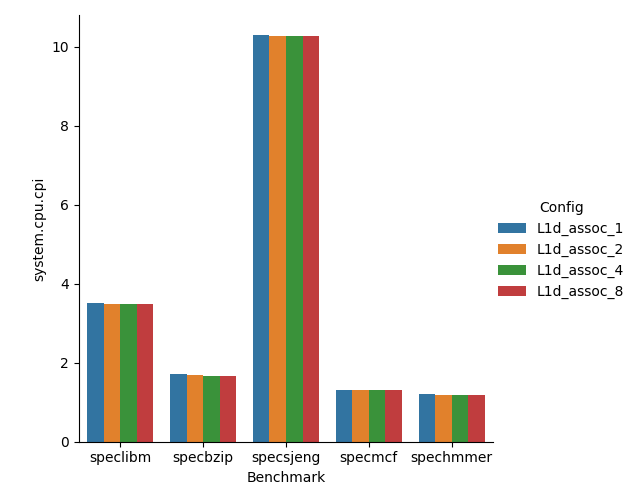 | 
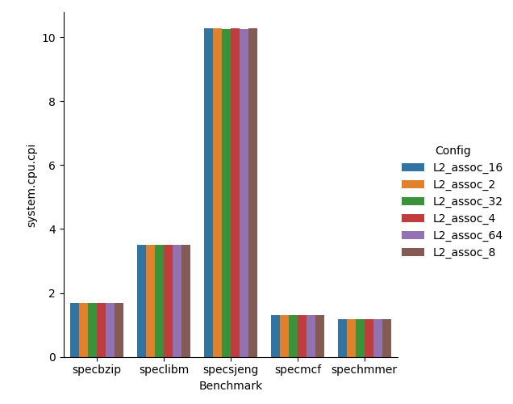 |


After observing these results, we decided to run another set of benchmarks, this time with cache line size of 128 and 256, since they seemed to give better performance. Keeping those at their new values, we tweaked the other parameters.

Here are a few graphs of the different configurations:

_              |  _
:-------------:|:--------------:
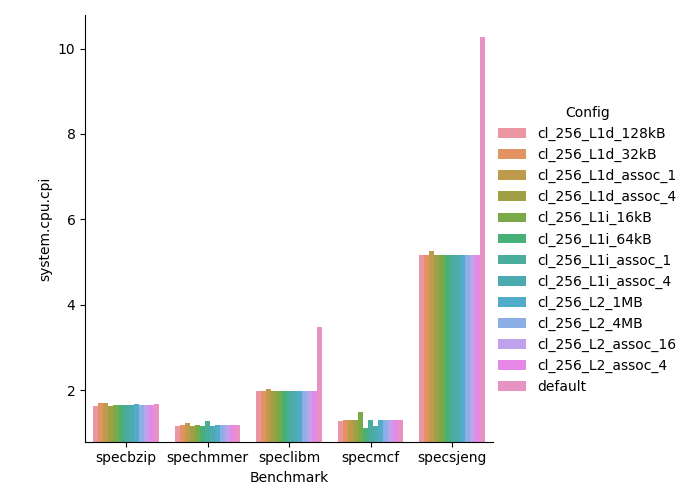 | 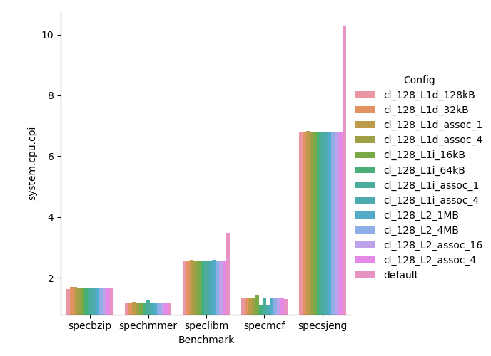

From all these, we selected and plotted the best performing configurations for each benchmark:

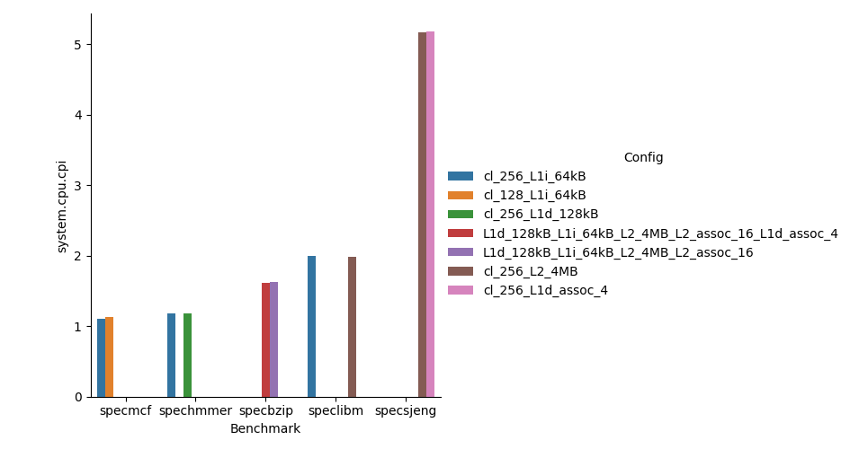

 We can observe that certain characteristics produce the best results, thus we made combinations of them that would lead to optimal performance.

From all this data we collected, we can see the 10 configurations with the best CPI for each benchmark on the following tables (sorted by increasing CPI).

(**when no value is specified, it means that we used the default**): 
   
    

### **`specmcf`**

|Config                                                               |system.cpu.cpi|
|---------------------------------------------------------------------|--------------|
|cl_256_L2_4MB_L1i_64kB_L1d_128kB_L2_assoc_16_L1d_assoc_8_L1i_assoc_8 |1.10746       |
|cl_256_L2_4MB_L1i_64kB_L1d_128kB_L2_assoc_16_L1d_assoc_4_L1i_assoc_16|1.10763       |
|cl_256_L2_4MB_L1i_64kB_L1d_128kB_L2_assoc_16_L1d_assoc_4_L1i_assoc_8 |1.10763       |
|cl_256_L2_4MB_L1i_64kB_L1d_128kB_L2_assoc_16_L1d_assoc_4_L1i_assoc_4 |1.10763       |
|cl_256_L1i_64kB                                                      |1.110613      |
|cl_128_L1i_64kB                                                      |1.124752      |
|cl_128_L1i_assoc_4                                                   |1.124828      |
|L1d_128kB_L1i_64kB_L2_4MB_L2_assoc_16_L1d_assoc_4                    |1.154547      |
|L1d_128kB_L1i_64kB_L2_4MB                                            |1.154704      |
|L1d_128kB_L1i_64kB_L2_4MB_L2_assoc_16                                |1.154704      |

### **`spechmmer`**

|Config                                                               |system.cpu.cpi|
|---------------------------------------------------------------------|--------------|
|cl_256_L2_4MB_L1i_64kB_L1d_128kB_L2_assoc_16_L1d_assoc_8_L1i_assoc_8 |1.177095      |
|cl_256_L2_4MB_L1i_64kB_L1d_128kB_L2_assoc_16_L1d_assoc_4_L1i_assoc_16|1.177306      |
|cl_256_L2_4MB_L1i_64kB_L1d_128kB_L2_assoc_16_L1d_assoc_4_L1i_assoc_8 |1.177306      |
|cl_256_L2_4MB_L1i_64kB_L1d_128kB_L2_assoc_16_L1d_assoc_4_L1i_assoc_4 |1.177387      |
|cl_256_L1d_128kB                                                     |1.17844       |
|cl_256_L1i_64kB                                                      |1.179064      |
|cl_256_L1d_assoc_4                                                   |1.179175      |
|cl_256_L1i_assoc_4                                                   |1.179334      |
|Cacheline_256                                                        |1.179864      |
|cl_256_L2_4MB                                                        |1.179864      |

### **`specbzip`**

|Config                                                               |system.cpu.cpi|
|---------------------------------------------------------------------|--------------|
|cl_256_L2_4MB_L1i_64kB_L1d_128kB_L2_assoc_16_L1d_assoc_8_L1i_assoc_8 |1.591869      |
|cl_256_L2_4MB_L1i_64kB_L1d_128kB_L2_assoc_16_L1d_assoc_4_L1i_assoc_4 |1.600096      |
|cl_256_L2_4MB_L1i_64kB_L1d_128kB_L2_assoc_16_L1d_assoc_4_L1i_assoc_16|1.600188      |
|cl_256_L2_4MB_L1i_64kB_L1d_128kB_L2_assoc_16_L1d_assoc_4_L1i_assoc_8 |1.600344      |
|L1d_128kB_L1i_64kB_L2_4MB_L2_assoc_16_L1d_assoc_4                    |1.616081      |
|L1d_128kB_L1i_64kB_L2_4MB_L2_assoc_16                                |1.623941      |
|L1d_128kB_L1i_64kB_L2_4MB                                            |1.624346      |
|cl_256_L1d_128kB                                                     |1.624496      |
|cl_128_L1d_128kB                                                     |1.634732      |
|cl_256_L1d_assoc_4                                                   |1.645503      |

### **`speclibm`**

|Config                                                               |system.cpu.cpi|
|---------------------------------------------------------------------|--------------|
|cl_256_L2_4MB                                                        |1.989307      |
|cl_256_L2_4MB_L1i_64kB_L1d_128kB_L2_assoc_16_L1d_assoc_4_L1i_assoc_16|1.989308      |
|cl_256_L2_4MB_L1i_64kB_L1d_128kB_L2_assoc_16_L1d_assoc_8_L1i_assoc_8 |1.989308      |
|cl_256_L2_4MB_L1i_64kB_L1d_128kB_L2_assoc_16_L1d_assoc_4_L1i_assoc_8 |1.989308      |
|cl_256_L2_4MB_L1i_64kB_L1d_128kB_L2_assoc_16_L1d_assoc_4_L1i_assoc_4 |1.989308      |
|cl_256_L1i_64kB                                                      |1.990606      |
|cl_256_L1i_16kB                                                      |1.990648      |
|cl_256_L1d_assoc_4                                                   |1.990648      |
|cl_256_L1d_32kB                                                      |1.990648      |
|cl_256_L2_assoc_16                                                   |1.990648      |

### **`specsjeng`**

|Config                                                               |system.cpu.cpi|
|---------------------------------------------------------------------|--------------|
|cl_256_L2_4MB_L1i_64kB_L1d_128kB_L2_assoc_16_L1d_assoc_8_L1i_assoc_8 |5.171358      |
|cl_256_L2_4MB_L1i_64kB_L1d_128kB_L2_assoc_16_L1d_assoc_4_L1i_assoc_4 |5.171385      |
|cl_256_L2_4MB_L1i_64kB_L1d_128kB_L2_assoc_16_L1d_assoc_4_L1i_assoc_8 |5.171385      |
|cl_256_L2_4MB_L1i_64kB_L1d_128kB_L2_assoc_16_L1d_assoc_4_L1i_assoc_16|5.171443      |
|cl_256_L2_4MB                                                        |5.17157       |
|cl_256_L1d_assoc_4                                                   |5.17556       |
|cl_256_L1d_128kB                                                     |5.175684      |
|Cacheline_256                                                        |5.175719      |
|cl_256_L1i_64kB                                                      |5.175745      |
|cl_256_L2_assoc_16                                                   |5.175774      |


Next, we were curious to find the configuration that gave the best general performance in all benchmarks. In order to do that, we had to normalize the IPC for each benchmark, so that all benchmarks have the same influence regardless of the order of magnitude of their CPI. 

Thus, we used a "speedup" metric, which is defined as the IPC of each benchmark result, normalized by the IPC of the default configuration on the same benchmark. Then, we found the average speedup of each configuration for all benchmarks. The best configurations were those that resulted in the highest average speedup.

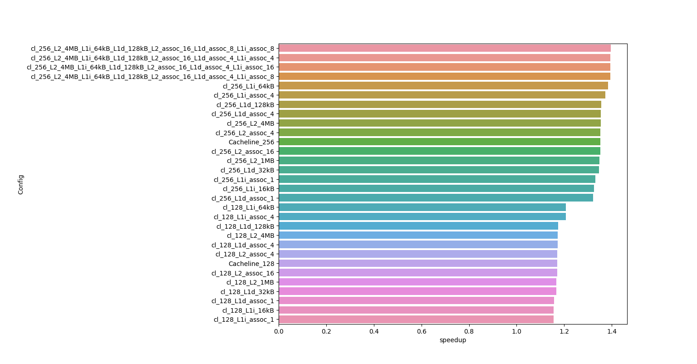


## Step 3: Optimization of performance/cost ratio

In computer architecture design, all choices have benefits and drawbacks, thus any potential improvements need to be measured against the "cost" they introduce. 

That cost can be one of the following:

+ heat / TDP  
+ additional complexity -> latency
+ additional area of silicon -> waffers/ yield rates depending on die size -> dollar cost

It is expected that some changes, while they may improve performance, they also introduce an disproportionate cost, which makes them not optimal. Thus, the best performing configurations in step 2 will probably have a prohibitive cost relative to their performance uplift. In addition, we expect to be able to cut corners on some non-critical specs, and give priority to the most influential specs.

We devised a cost function of the following form:

$$cost(x_1, x_2 , ... ,x_n) =  c\sum_{i=1}^{n}\frac{w_i}{a_i}x_i $$

$$c = \frac{1}{ \sum_{i=1}^{n} w_i }$$


$$c = \frac{1}{ (\sum_{i=1}^{n}) w_i }$$


$$c = \frac{1}{ \sum^{n}_{i=1} w_i }$$

$$
\displaystyle\sum_{k=3}^5 k^2=3^2 + 4^2 + 5^2 =50
$$

$$
\displaystyle\sum_{i=1}^n w_i
$$


 Inputs $x_1, ... ,x_n$ are the values of CPU configuration parameters, which are normalized using $a_1, ... ,a_n$. Then, a different weight is used for each parameter, $w_1, ... ,w_n$. The sum calculates a cost value for each configuration. For simplicity, this function is expressed as a linear combination of the parameters (in the real world, we know that a non-linear function, with complex relationships between variables, would be more appropriate).

In this example, inputs $x_1, ... ,x_n$ and their units are shown below. Also, $a_1, ... ,a_n$ and $c$ were chosen so that the default MinorCPU configuration has a cost of 1, while the weights $w_1, ... ,w_n$ were chosen based on intuition:

| Parameter $(x)$     |normalization $(a)$|weight $(w)$|
|---------------|-|-|
|L1i (kB)        |32|5|
|L1d (kB)        |64|5|
|L2 (MB)         |2|2|
|cacheline size |64|2|
|L1i_assoc      |2|8|
|L1d_assoc      |2|8|
|L2_assoc       |8|4|

Then, for each CPU configuration, we calculate the Performance to Cost Ratio (PCR), which is the speedup (Instructions per Cycle normalized for each benchmark) divided by the cost of that configuration (given by the cost function).

Again, we remind that the cost, speedup and PCR values are normalized so that the default configuration has cost, speedup and PCR equal to 1.

Using the PCR value, we can rank the configurations we tested. Here are the best performing ones:

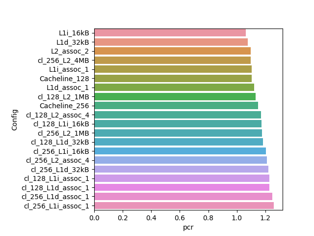

Here are the worst performing ones:

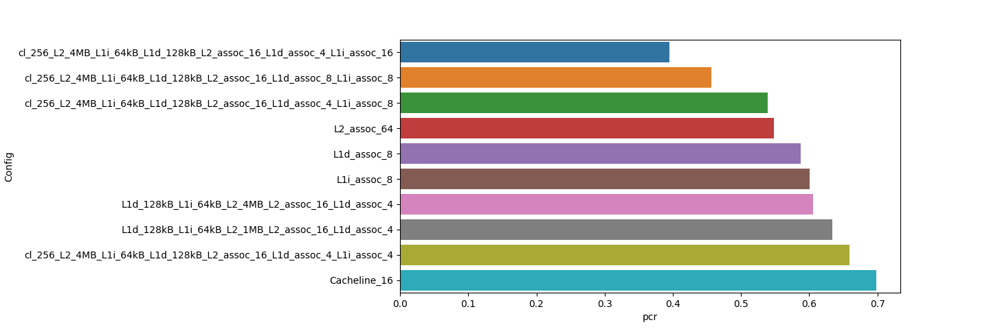

Here are all speedup, cost and PCR values for the configurations we tested (sorted by PCR):

|Config                                                               |Cost              |speedup           |pcr               |
|---------------------------------------------------------------------|------------------|------------------|------------------|
|cl_256_L2_4MB_L1i_64kB_L1d_128kB_L2_assoc_16_L1d_assoc_4_L1i_assoc_16|3.5294117647058827|1.394727942180765 |0.3951729169512168|
|cl_256_L2_4MB_L1i_64kB_L1d_128kB_L2_assoc_16_L1d_assoc_8_L1i_assoc_8 |3.0588235294117645|1.3959037411019   |0.4563531461294673|
|cl_256_L2_4MB_L1i_64kB_L1d_128kB_L2_assoc_16_L1d_assoc_4_L1i_assoc_8 |2.588235294117647 |1.3947119331028104|0.5388659741533586|
|L2_assoc_64                                                          |1.8235294117647058|0.9998888141545146|0.5483261238911854|
|L1d_assoc_8                                                          |1.7058823529411764|1.0027801901775113|0.5878366632075067|
|L1i_assoc_8                                                          |1.7058823529411764|1.0248691686702702|0.6007853747377447|
|L1d_128kB_L1i_64kB_L2_4MB_L2_assoc_16_L1d_assoc_4                    |1.7058823529411764|1.0336242839109184|0.6059176836719178|
|L1d_128kB_L1i_64kB_L2_1MB_L2_assoc_16_L1d_assoc_4                    |1.6176470588235294|1.0246571562452218|0.6334244238606825|
|cl_256_L2_4MB_L1i_64kB_L1d_128kB_L2_assoc_16_L1d_assoc_4_L1i_assoc_4 |2.1176470588235294|1.3947305840802877|0.6586227758156914|
|Cacheline_16                                                         |0.9558823529411764|0.667542427086224 |0.6983520775671266|
|L1d_128kB_L1i_64kB_L2_4MB_L2_assoc_16                                |1.4705882352941178|1.032557423923098 |0.7021390482677066|
|L2_assoc_32                                                          |1.3529411764705883|0.9999214909684234|0.739072406367965 |
|L1d_128kB_L1i_64kB_L2_1MB_L2_assoc_16                                |1.3823529411764706|1.0236441469303679|0.7405085318219683|
|L1d_128kB_L1i_64kB_L2_4MB                                            |1.3529411764705883|1.0324894913765852|0.7631444066696499|
|L1d_128kB_L1i_64kB                                                   |1.2941176470588236|1.028815422048155 |0.7949937352190288|
|L1d_128kB_L1i_64kB_L2_1MB                                            |1.2647058823529411|1.0234041962978178|0.8092033180029258|
|L1d_assoc_4                                                          |1.2352941176470589|1.0020177780466648|0.8111572488949191|
|L1i_assoc_4                                                          |1.2352941176470589|1.0248706293501608|0.8296571761406064|
|Cacheline_32                                                         |0.9705882352941175|0.8269773253967264|0.8520372443481424|
|L1d_128kB                                                            |1.1470588235294117|1.0038953254655467|0.8751907965597076|
|L1i_64kB                                                             |1.1470588235294117|1.0248470284081126|0.8934563837404059|
|L2_assoc_16                                                          |1.1176470588235294|0.9997971076483937|0.8945553068432996|
|cl_128_L1d_assoc_4                                                   |1.2941176470588236|1.1727738890792945|0.9062343688340002|
|cl_128_L1i_assoc_4                                                   |1.2941176470588236|1.2063970829202337|0.9322159277110895|
|L2_4MB                                                               |1.0588235294117647|1.0035169329772848|0.9477659922563246|
|cl_256_L1d_assoc_4                                                   |1.411764705882353 |1.3537763933841525|0.9589249453137747|
|cl_256_L1i_assoc_4                                                   |1.411764705882353 |1.3731367219059332|0.972638511350036 |
|cl_128_L1d_128kB                                                     |1.2058823529411764|1.1749124507419773|0.974317642078713 |
|cl_128_L2_assoc_16                                                   |1.1764705882352942|1.1705460438533313|0.9949641372753316|
|default                                                              |1.0               |1.0               |1.0               |
|cl_128_L1i_64kB                                                      |1.2058823529411764|1.206482796346822 |1.0004979286778526|
|cl_256_L1d_128kB                                                     |1.3235294117647058|1.3566568487852435|1.025029619082184 |
|L2_1MB                                                               |0.9705882352941175|0.9955074888047323|1.0256743824048757|
|cl_256_L2_assoc_16                                                   |1.2941176470588236|1.3513897190842221|1.0442556920196262|
|cl_256_L1i_64kB                                                      |1.3235294117647058|1.3853358831714602|1.0466982228406587|
|cl_128_L2_4MB                                                        |1.1176470588235294|1.1735281044839472|1.0499988303277423|
|L2_assoc_4                                                           |0.9411764705882353|1.0001068811791995|1.0626135612528995|
|L1i_16kB                                                             |0.9264705882352942|0.9851128357071177|1.0632963940965716|
|L1d_32kB                                                             |0.9264705882352942|0.9961731125592689|1.0752344706988932|
|L2_assoc_2                                                           |0.9117647058823529|0.9989885857655555|1.095664900517061 |
|cl_256_L2_4MB                                                        |1.2352941176470589|1.3536340449802593|1.095798988793543 |
|L1i_assoc_1                                                          |0.8823529411764707|0.9749218865401266|1.1049114714121435|
|Cacheline_128                                                        |1.0588235294117647|1.1706181858199394|1.105583842163276 |
|L1d_assoc_1                                                          |0.8823529411764707|0.9907562544296897|1.1228570883536484|
|cl_128_L2_1MB                                                        |1.0294117647058822|1.166753050160333 |1.1334172487271807|
|Cacheline_256                                                        |1.1764705882352942|1.3514515790991175|1.14873384223425  |
|cl_128_L2_assoc_4                                                    |1.0               |1.170680918327676 |1.170680918327676 |
|cl_128_L1i_16kB                                                      |0.9852941176470589|1.1564753582658653|1.1737361845086394|
|cl_256_L2_1MB                                                        |1.1470588235294117|1.3477296790330064|1.1749438227467235|
|cl_128_L1d_32kB                                                      |0.9852941176470589|1.166362431199271 |1.1837708256947825|
|cl_256_L1i_16kB                                                      |1.1029411764705883|1.326242734778369 |1.2024600795323876|
|cl_256_L2_assoc_4                                                    |1.1176470588235294|1.351530010018745 |1.2092636931746665|
|cl_256_L1d_32kB                                                      |1.1029411764705883|1.3458197666049367|1.2202099217218092|
|cl_128_L1i_assoc_1                                                   |0.9411764705882353|1.1555992200211362|1.2278241712724571|
|cl_128_L1d_assoc_1                                                   |0.9411764705882353|1.1571102326089766|1.2294296221470378|
|cl_256_L1d_assoc_1                                                   |1.0588235294117647|1.3222359048188599|1.2487783545511455|
|cl_256_L1i_assoc_1                                                   |1.0588235294117647|1.3320113894143781|1.258010756669135 |


From this data, we confirm our prediction that the most high-spec CPUs have a very large cost compared to the speedup they provide, and thus have a small PCR. The best configurations are a result of more fine-tuned architectural choices.

For better and more accurate conclusions, here are a few things we could have done differently:
- Running the simulations all the way to the end (in the above benchmarks, we only allowed gem5 to run up to 100000000 instructions).
- Running a larger number and variety of benchmarks, that accurately represent the average workload of a modern system.
- Directly use the PCR metric to choose which configurations to explore, instead of using CPI.


## Feedback on Assignment 2
- We were able to make automation and plotting scripts using shell script and python, however we believe that more guidance would be beneficial, especially for people who may not be familiar with them.
- We were able to run many simulations at the same time in parallel, which sped up the proccess significantly.
- The cost-performance analysis was very interesting, but never discussed before in class. Thus, we had to improvise.
