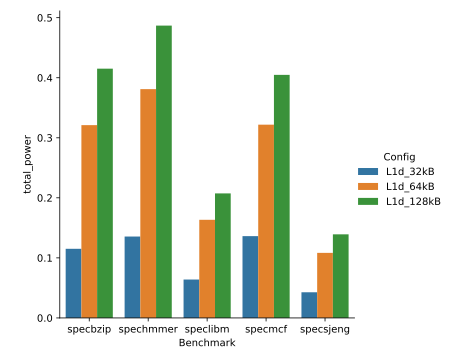
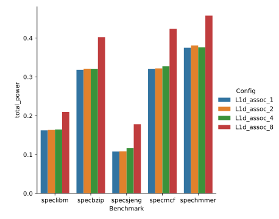
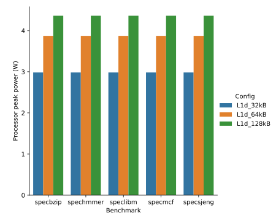
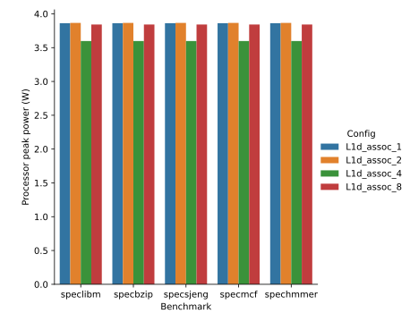
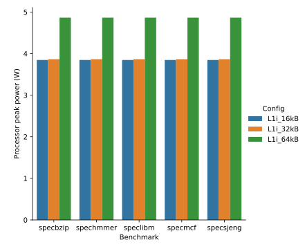
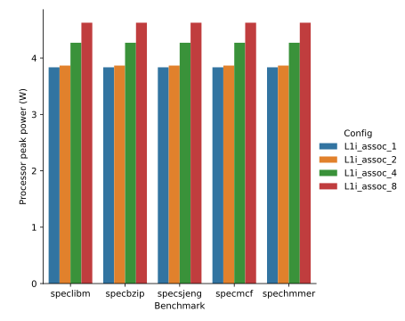
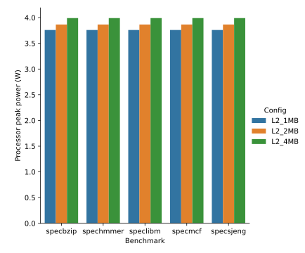
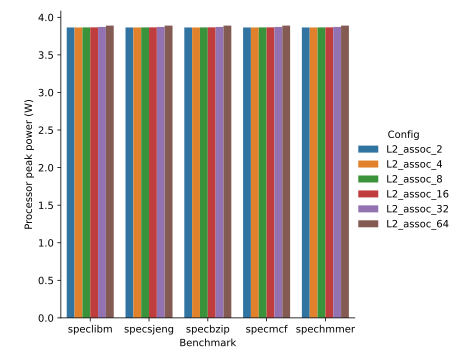
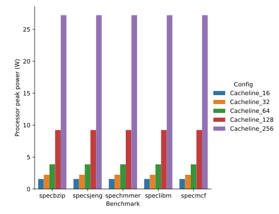
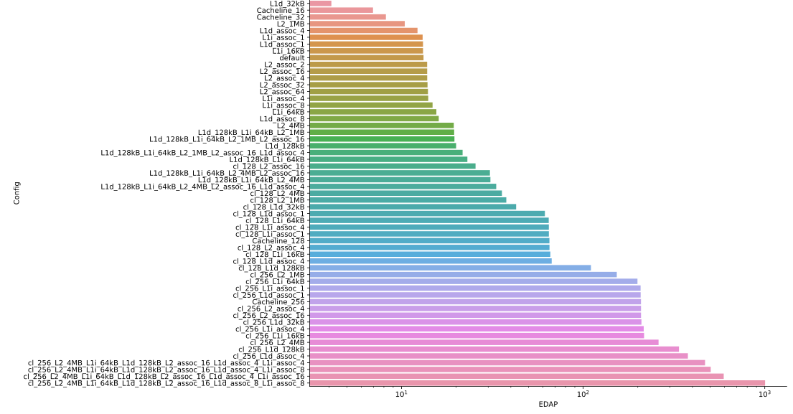

# Third Assignment: Energy-Delay-Area Product Optimization (gem5 + McPAT)

## Step 1: Introduction to McPAT

### 1. Dynamic Power - Leakage Power

In general, leakage power is the power demand of an idle system, while dynamic power is the power demand that fluctuates depending on the load.

In a CPU, dynamic power is caused by logic gates changing state. Leakage power is caused by transistor leakage current and happens even when no change of state is necessary.

Dynamic power depends on the characteristics of the program executed, because certain CPU modules/instructions may consume more power than others. Leakage power is constant and does not get affected by the program.

Since we are talking about power, the execution time of a program doesn't directly affect these two metrics (assuming that the program's resource demands stay constant). But running a program for a long time can heat up the processor which depending on the coolling solution can set limitation on the dynamic power. 

### 2. Assessing energy usage

In this example, we are asked to choose between a 5 Watt and a 50 Watt CPU, in order to maximize working time on a battery of limited capacity.

While the 5 Watt CPU may seem (at first glance) more appropriate, we cannot be 100% sure of that choice. That's beacause it's not specified if these power figures refer to peak, TDP or average power consumption.

One could imagine a scenario where the "5 Watt" CPU always consumes 5 Watts, while the "50 Watt" CPU has a peak consumption of 50 Watts, but over the course of a workload only consumes 3 Watts on average.

(Fun fact: The Intel i5 CPU powering the laptop where this text is written, can go from 2 Watts when idle, to 25 Watts of power consumption, just by running McPAT :D )

The stats given by McPAT can give us a better answer, as we can compare both peak power and "runtime" power (which accounts for the CPU utilization profile). McPAT also supports power management (CPU frequency/voltage reacting to temperature/power) and power saving ("disabling" idle circuit blocks) features used by modern CPUs.

### 3. Xeon vs ARM A9

In this section, we are assessing whether a Xeon can be more efficient than an ARM A9, under the assumption that the Xeon can finish the same workload 50 times faster.

Under that assumption, the Xeon would have to consume more than 50x the power compared to the ARM A9 in order be less efficient. 

Here are statistics from McPAT for the two CPUs:

| Statistic       | Xeon      | ARM A9   |
|:----------------|:---------:|:--------:|
| Peak Power      | 134.938 W | 1.7419 W |
| Total Leakage   | 36.831 W  | 0.1087 W |
| Peak Dynamic    | 98.106 W  | 1.6332 W |
| Runtime Dynamic | 72.919 W  | 2.9605 W |

According to these statistics, the Xeon could in theory be more efficient, as the Runtime Dynamic power consumption is only 24.6x higher than the ARM. However, we also observe that the Total Leakage is more than 300x higher.

Thus, if the workload consumes only a small proportion of the Peak Dynamic power, the Xeon can end up having more than 50x average power demand.

Let's express this with an equation, assuming average power consumption is given as follows:

$$
P_{avg} = P_L + kP_{D}
$$

Where $P_L$ is the leakage power, $P_D$ is the peak dynamic power, and $k\in[0,1]$ expresses the amount of dynamic load relative to peak.

We observe that, if $k$ is small enough, $P_{avg}$ will mostly depend on $P_L$

## Step 2: gem5 + McPAT: Optimizing the Energy-Delay Product (EDP)

### 1. Energy consumption

Using McPAT, we calculated the power consumption for all the different configurations and benchmarks from the 2nd assignment. Here is a small sample of our results showing total power (Core Runtime Dynamic + L2 Runtime Dynamic power):

|L1d size        |  L1d associativity |
:-------------:|:--------------:|
|  | |

All results can be found in the .csv files in this repository.

### 2. Peak power consumption for different configurations

| - | - |
|:-:|:-:|
| | |
| | |
| | |
|| |

### 3. Finding the ideal architecture

To find the most efficient and performant architecture, we had to combine the performance results from the previous assignment, with the statistics from McPAT.

We used the following simple EDAP cost function, that accounts for performance (CPI), power usage and area:

$$
EDAP = CPI * Power * Area 
$$

For the $Power$ we calculate the sum of "core dynamic power" and "L2 dynamic power". Similarly, for the $Area$ we use the sum of "core area" and "L2 area". Additionally, for the $CPI$ and $Power$, we took the average of that configuration across all benchmarks, so that we could have a single EDAP number for each configuration.

Using this metric, we can sort the different CPU configurations. The ideal CPU would be the one that minimized the EDAP metric.

It's important to mention that two or more configurations can have similar EDAP values. For example, a very fast but power demanding CPU can have the same EDAP value with a slower low-power CPU (assuming similar area). In that case, we would choose acoording to what we value the most.

From our results, we observe that the CPUs with the best EDAP value are not necessarily the fastest ones, but they are the ones that ommit resources which are not beneficial. We can see that all configurations (except L1d_assoc_4) that have a better EDAP than the default, are ones that ommit features, having a similar CPI but a much lower power demand.

Here is a graph of our results:

Here are our results in more detail:

|Config                                                               |system.cpu.cpi|speedup|total_power (W)|total_area (mm^2)|EDAP    |
|--------------------------------------------------------------------:|--------------|-------|---------------|-----------------|--------|
|L1d_32kB                                                             |3.592         |0.996  |0.099          |11.598           |4.111   |
|Cacheline_16                                                         |9.611         |0.667  |0.065          |11.155           |6.968   |
|Cacheline_32                                                         |5.514         |0.827  |0.129          |11.513           |8.206   |
|L2_1MB                                                               |3.594         |0.996  |0.255          |11.391           |10.424  |
|L1d_assoc_4                                                          |3.583         |1.002  |0.261          |13.092           |12.251  |
|L1i_assoc_1                                                          |3.619         |0.975  |0.254          |14.195           |13.071  |
|L1d_assoc_1                                                          |3.605         |0.991  |0.257          |14.189           |13.136  |
|L1i_16kB                                                             |3.607         |0.985  |0.257          |14.174           |13.138  |
|default                                                              |3.586         |1.000  |0.259          |14.229           |13.222  |
|L2_assoc_2                                                           |3.588         |0.999  |0.259          |14.916           |13.843  |
|L2_assoc_16                                                          |3.587         |1.000  |0.259          |14.902           |13.849  |
|L2_assoc_4                                                           |3.586         |1.000  |0.259          |14.911           |13.852  |
|L2_assoc_32                                                          |3.586         |1.000  |0.260          |14.951           |13.909  |
|L2_assoc_64                                                          |3.585         |1.000  |0.261          |14.949           |13.985  |
|L1i_assoc_4                                                          |3.557         |1.025  |0.263          |14.992           |14.035  |
|L1i_assoc_8                                                          |3.557         |1.025  |0.263          |15.838           |14.827  |
|L1i_64kB                                                             |3.557         |1.025  |0.263          |16.620           |15.559  |
|L1d_assoc_8                                                          |3.582         |1.003  |0.334          |13.393           |16.033  |
|L2_4MB                                                               |3.579         |1.004  |0.264          |20.547           |19.402  |
|L1d_128kB_L1i_64kB_L2_1MB                                            |3.561         |1.023  |0.333          |16.437           |19.493  |
|L1d_128kB_L1i_64kB_L2_1MB_L2_assoc_16                                |3.560         |1.024  |0.333          |16.494           |19.567  |
|L1d_128kB                                                            |3.580         |1.004  |0.331          |16.884           |19.985  |
|L1d_128kB_L1i_64kB_L2_1MB_L2_assoc_16_L1d_assoc_4                    |3.559         |1.025  |0.346          |17.613           |21.694  |
|L1d_128kB_L1i_64kB                                                   |3.551         |1.029  |0.337          |19.275           |23.052  |
|cl_128_L2_assoc_16                                                   |2.712         |1.171  |0.458          |20.598           |25.565  |
|L1d_128kB_L1i_64kB_L2_4MB_L2_assoc_16                                |3.544         |1.033  |0.340          |25.425           |30.673  |
|L1d_128kB_L1i_64kB_L2_4MB                                            |3.544         |1.032  |0.340          |25.594           |30.866  |
|L1d_128kB_L1i_64kB_L2_4MB_L2_assoc_16_L1d_assoc_4                    |3.542         |1.034  |0.353          |26.544           |33.227  |
|cl_128_L2_4MB                                                        |2.707         |1.173  |0.467          |28.277           |35.717  |
|cl_128_L2_1MB                                                        |2.719         |1.167  |0.471          |29.481           |37.758  |
|cl_128_L1d_32kB                                                      |2.719         |1.166  |0.327          |48.132           |42.771  |
|cl_128_L1d_assoc_1                                                   |2.737         |1.157  |0.454          |49.504           |61.576  |
|cl_128_L1i_64kB                                                      |2.671         |1.206  |0.477          |50.693           |64.640  |
|cl_128_L1i_assoc_4                                                   |2.671         |1.206  |0.477          |50.762           |64.737  |
|cl_128_L1i_assoc_1                                                   |2.731         |1.156  |0.492          |48.237           |64.757  |
|Cacheline_128                                                        |2.712         |1.171  |0.486          |49.474           |65.221  |
|cl_128_L2_assoc_4                                                    |2.712         |1.171  |0.486          |49.542           |65.275  |
|cl_128_L1i_16kB                                                      |2.733         |1.157  |0.489          |49.365           |65.978  |
|cl_128_L1d_assoc_4                                                   |2.708         |1.173  |0.501          |49.424           |67.128  |
|cl_128_L1d_128kB                                                     |2.705         |1.175  |0.785          |51.956           |110.401 |
|cl_256_L2_1MB                                                        |2.268         |1.348  |0.995          |67.884           |153.179 |
|cl_256_L1i_64kB                                                      |2.224         |1.385  |0.989          |90.501           |199.084 |
|cl_256_L1i_assoc_1                                                   |2.286         |1.332  |1.031          |87.850           |207.146 |
|cl_256_L1d_assoc_1                                                   |2.308         |1.322  |0.993          |90.452           |207.349 |
|Cacheline_256                                                        |2.261         |1.351  |1.019          |90.387           |208.207 |
|cl_256_L2_assoc_4                                                    |2.261         |1.351  |1.018          |90.427           |208.261 |
|cl_256_L2_assoc_16                                                   |2.261         |1.351  |1.020          |90.348           |208.321 |
|cl_256_L1d_32kB                                                      |2.270         |1.346  |1.022          |90.263           |209.411 |
|cl_256_L1i_assoc_4                                                   |2.236         |1.373  |1.004          |96.041           |215.528 |
|cl_256_L1i_16kB                                                      |2.299         |1.326  |1.039          |90.628           |216.491 |
|cl_256_L2_4MB                                                        |2.258         |1.354  |1.042          |110.639          |260.134 |
|cl_256_L1d_128kB                                                     |2.253         |1.357  |1.573          |95.091           |336.983 |
|cl_256_L1d_assoc_4                                                   |2.258         |1.354  |1.742          |95.948           |377.290 |
|cl_256_L2_4MB_L1i_64kB_L1d_128kB_L2_assoc_16_L1d_assoc_4_L1i_assoc_4 |2.209         |1.395  |1.757          |120.820          |468.998 |
|cl_256_L2_4MB_L1i_64kB_L1d_128kB_L2_assoc_16_L1d_assoc_4_L1i_assoc_8 |2.209         |1.395  |1.757          |129.813          |503.906 |
|cl_256_L2_4MB_L1i_64kB_L1d_128kB_L2_assoc_16_L1d_assoc_4_L1i_assoc_16|2.209         |1.395  |1.757          |153.054          |594.136 |
|cl_256_L2_4MB_L1i_64kB_L1d_128kB_L2_assoc_16_L1d_assoc_8_L1i_assoc_8 |2.207         |1.396  |3.235          |140.586          |1004.063|

